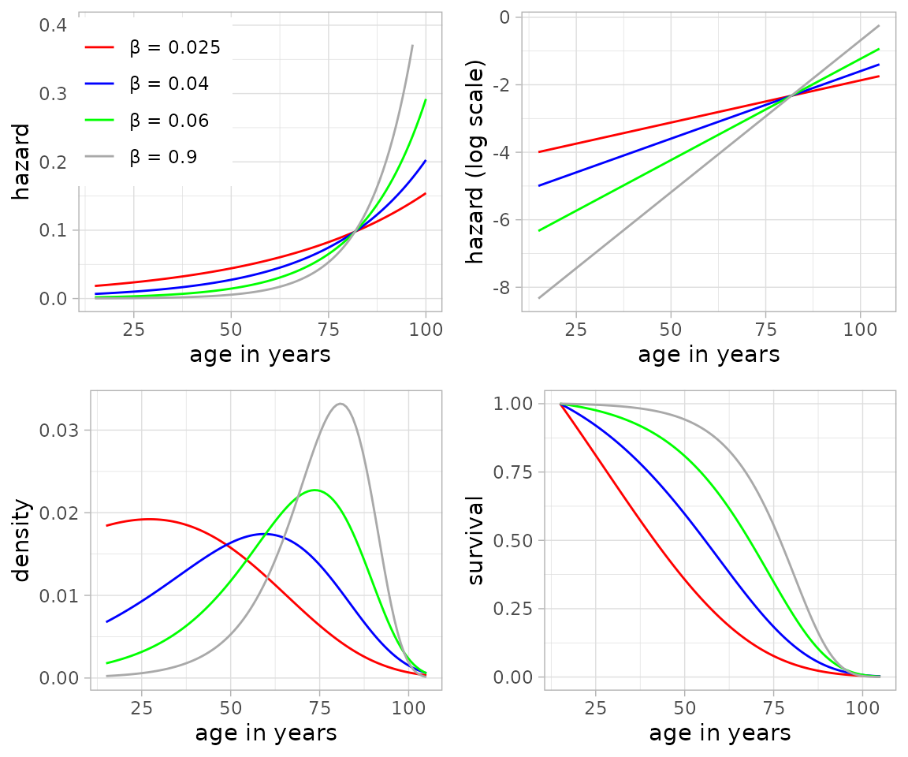

# Mathematical background

## Benjamin Gompertz and the Gompertz distribution

Central to `baytaAAR` is the Gompertz distribution, named after the
British mathematician [B.
Gompertz](https://en.wikipedia.org/wiki/Benjamin_Gompertz) (1779–1865)
who first presented it in 1825 (Gompertz 1825).

Hazard, survival and the ensuing probability distribution are defined as
follows (see also Wood et al. 2002, 146):

``` math
\begin{align}
\mu(t) & = \alpha \cdot \exp(\beta t) \\
S(t) & = \exp\big(\frac{\alpha}{\beta} \cdot (1-\exp(\beta  t))\big) \\
f_0(t \mid \alpha,\beta) & = \alpha \cdot \exp\big(\beta t + \frac{\alpha}{\beta} \cdot (1-\exp(\beta t))\big)
\end{align}
```

Despite or even because of its simplicity, it is still widely applied.
Instrumental for `baytaAAR` is the strong empirical correlation between
its two parameters $`\alpha`$ and $`\beta`$, the so-called
*Strehler-Mildvan-correlation* (Strehler and Mildvan 1960). This makes
it possible to reformulate it as essentially a one-parameter
distribution that still captures human mortality adequately. The
empirical correlation between the two parameters at the age of 15 years
was defined by T. Sasaki and O. Kondo (2016, 529 fig. 1) as follows:

``` math
\begin{align}
Sab & = -2.624 \\
Sbb & = 0.0393 \\
Ma & = -7.119 \\
Mb & = 0.0718 \\
V & = 0.0823 \\
ln\alpha & \sim \mathrm{dnorm} (Sab \cdot (\beta - Mb)/Sbb + Ma, 1 / V ) \\
\alpha & = \exp(ln\alpha)
\end{align}
```
Here, a normal distribution with a variance term of 0.0823 serves as a
basis to model log-transformed $`\alpha`$. If the variance term is
omitted, the relationship between $`\alpha`$ and $`\beta`$ becomes
deterministic:

``` math
\alpha =\exp(Sab \cdot (\beta - Mb)/Sbb + Ma)
```
If the starting age is not 15, we simulate the relation with the
internal function
[`gomp.a0()`](https://isaakiel.github.io/baytaAAR/reference/gomp.a0.md).

The parameter $`\beta`$ is estimated from the observed data, thereby
defining the overall level of mortality of the respective population and
the age range of the individuals. The following figure, taken from
Müller-Scheeßel et al. (2024, 4 fig. 1), shows Gompertz hazard, survival
and density curves with different $`\beta`$ values:



The modal age *M* derives naturally from the Gompertz model. It equals
the peak of the curves in the lower left image. It is a useful parameter
for adult mortality as it does not change with the starting observed age
as life expectancy does (Missov et al. 2015). So, for example, e₂₀ (life
expectancy from age 20) will differ from e₂₅ (life expectancy from age
25), and the one is not easily translated to the other. This is not the
case with the modal age *M*. The modal age *M* is defined as:
``` math
M = \frac{1}{\beta} \cdot log\big(\frac{\beta}{\alpha}\big)
```

## The Gompertz distribution with NIMBLE and JAGS

The Gompertz distribution is implemented in NIMBLE and JAGS with the
so-called ‘ones trick’, which is a simple, convenient way to implement
custom distributions (Kruschke 2015, 214–15). Theoretically, NIMBLE
allows custom functions to be added as `nimble functions` compiled at
runtime but we wanted to make sure that the results of the two
frameworks are as similar as possible.

## Mathematical notation

Building on this mortality model, we now describe how it is embedded in
the latent trait framework used by `baytaAAR`.

The observed data are written as $`y_{i,j}`$ where $`i`$ indexes
individuals from 1 to $`N`$ and $`j`$ indexes traits (skeletal age
“indicators”) from 1 to $`J`$. Because the data are recorded for ordinal
categorical traits the values for each trait are positive integers. The
number of states per trait is given as $`K_j`$. With $`K_j`$ states per
trait $`j`$, there are $`K_j - 1`$ thresholds for each trait.

``` math
i = 1,\dots,N, \qquad
j = 1,\dots,J, \qquad
k = 1,\dots,K_j
```

As stated above, the Gompertz model has two parameters $`\alpha`$ and
$`\beta`$. The prior for $`\beta`$ is:

``` math
\beta \sim \textit{U}(a = 0.02,\; b = 0.1)
```
where $`U(a, b)`$ denotes a uniform distribution with density
`1/(b - a)` between `a` and `b`. Simplifying the equation of Sasaki and
Kondo above, $`\alpha`$ is given deterministically as:

``` math
\alpha = \exp(-66.77 \cdot \beta - 2.325)
```

The prior for individual ages $`t_i`$, where $`t`$ is the age-at-death,
is

``` math
t_i \sim \textit{Gompertz}(\alpha,\; \beta)
```
The starting age $`t_0`$ is usually at 15 years, and the distribution is
truncated at `100 years - starting age`, reflecting a maximally expected
life span of 100 years.

The thresholds within each trait are represented using the symbol
$`\gamma`$, so that for a trait with five stages, the thresholds are
$`\gamma_{k_1 = 1} < \gamma_{k_1 = 2} < \gamma_{k_1 = 3} < \gamma_{k_1 = 4}`$.
To ensure identifiability, all $`\gamma_{k_j = 1} = 1.5`$.

The priors for thresholds with more than two states are:

``` math
\gamma_{k=2,…,K_j} \sim \textit{TN}(
\mu = k + 0.5,\;
\sigma = 10,\;
a,\;
b = \infty)
```

where $`TN()`$ is a truncated normal distribution with left truncation
at `a` and right truncation at `b`. Because the thresholds must be
ordered, for the JAGS-model, $`a = 1.5`$, and the simulated thresholds
are sorted in ascending order. NIMBLE does not have a sort-function, so
there $`a = \gamma_{k-1}`$.

For each individual there is a vector of latent traits $`z_i`$ of length
$`J`$ (number of traits). For the simple probit model with conditional
independence, the elements of these vectors are modeled separately with
normal distributions:

``` math
z_{i,j} \sim \mathcal{N}(\mu_{i,j},\; \sigma = 1)
```

For identifiability, $`\sigma`$ is fixed at $`unity`$ (1).

For the complex probit model, these vectors follow a multivariate normal
distribution:

``` math
\boldsymbol{z}_i \sim \mathcal{MVN}(
{\mu}_{i,j},\; 
\mathbf{R})
```

We use a “flat” prior by Lewandowski, Kurowicka, & Joe (2009) for the
correlation matrix:

``` math
\mathbf{R} \sim \textit{LKJ}(\eta = 1)
```

For $`\eta = 1`$, this prior is uniform over the space of correlation
matrices.

The components of the vector $`\mu_{i}`$ are:

``` math
\mu_{i,j} = \textit{beta}_{0_j} + \textit{beta}_j \cdot \ln(t_i)
```

with the priors for the $`beta_0`$ and $`beta`$ parameters within each
trait $`j`$ being:

``` math
\textit{beta}_{0_j} \sim \textit{TN}(\mu = 0,\; \sigma = 10,\; 
a = -\infty,\; b = 0)
```

``` math
\textit{beta}_{j} \sim \textit{TN}(\mu = 0,\; \sigma = 10,\; 
a = 0,\; b = \infty)
```

JAGS and NIMBLE both have the distribution `dinterval` which is
difficult to express succinctly:

``` math
y_{i,j} =
\begin{cases}
1, & \text{if } z_{i,j} \le 1.5, \\[6pt]
k_j, & \text{if } \gamma_{j,k_j-1} < z_{i,j} \le \gamma_{j,k_j},
\quad k_j=2,\dots,K_j-1, \\[6pt]
K_j, & \text{if } \gamma_{j,K_j-1} < z_{i,j} 
\end{cases}
```

Because `dinterval` indexes categories from `zero` instead of `one`, the
observed trait levels and thresholds are internally shifted by one unit.

The proper initialization of the chains is crucial in probit regression.
Each chain starts with different parameter values to enhance mixing, and
most parameters are initialized with random values from uniform
distributions. For Gompertz $`\beta`$ initial values are drawn from
`0.02–0.1`, for $`beta`$ the range is `0.5–1`, and for
$`beta_0`$`–10––3`. The init value for age $`t_i`$ is `20–40`. To this
value, the starting value (`15` by default) is added. The correlation
matrix is for all chains initialized with an identity matrix (ones on
the diagonal and zeros elsewhere). The thresholds are initialized with
`k + 0.5` and the vector of latent traits $`z_i`$ with
$`y_{i,j} - \textit{U}(-0.2, 0.2)`$.

------------------------------------------------------------------------

## References

Gompertz, Benjamin. 1825. “On the Nature of the Function Expressive of
the Law of Human Mortality, and on a New Mode of Determining the Value
of Life Contingencies.” *Philosophical Transactions of the Royal Society
of London* 115: 513–83. <https://doi.org/10.1098/rstl.1825.0026>.

Kruschke, John K. 2015. *Doing Bayesian data analysis: a tutorial with
R, JAGS, and Stan*. Academic Press.

Lewandowski, Daniel, Dorota Kurowicka, and Harry Joe. 2009. “Generating
random correlation matrices based on vines and extended onion method.”
*Journal of Multivariate Analysis* 100 (9): 1989–2001.
<https://doi.org/10.1016/j.jmva.2009.04.008>.

Missov, Trifon I., Adam Lenart, Laszlo Nemeth, Vladimir Canudas-Romo,
and James W. Vaupel. 2015. “The Gompertz Force of Mortality in Terms of
the Modal Age at Death.” *Demographic Research* 32: 1031–48.

Müller-Scheeßel, Nils, Christoph Rinne, and Katharina Fuchs. 2024.
“Adult mortality in the metropolis of London 1100–1850: A Bayesian view
based on osteological data.” *American Journal of Biological
Anthropology* 185 (3): e25025. <https://doi.org/10.1002/ajpa.25025>.

Sasaki, Tomohiko, and Osamu Kondo. 2016. “An Informative Prior
Probability Distribution of the Gompertz Parameters for Bayesian
Approaches in Paleodemography.” *American Journal of Physical
Anthropology* 159 (3): 523–33.

Strehler, Bernard L., and Albert S. Mildvan. 1960. “General Theory of
Mortality and Aging.” *Science* 132 (3418): 14–21.

Wood, James W., Darryl J. Holman, Kathleen A. O’Connor, and Rebecca J.
Ferrell. 2002. “Mortality Models for Paleodemography.” In
*Paleodemography: Age Distributions from Skeletal Samples*, edited by
Robert D. Hoppa and James W. Vaupel. Cambridge University Press.
